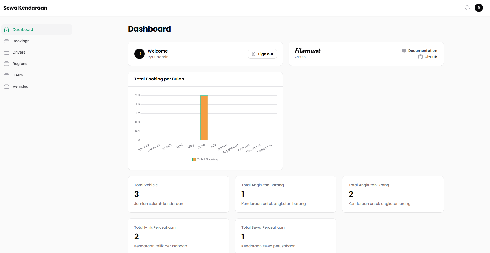
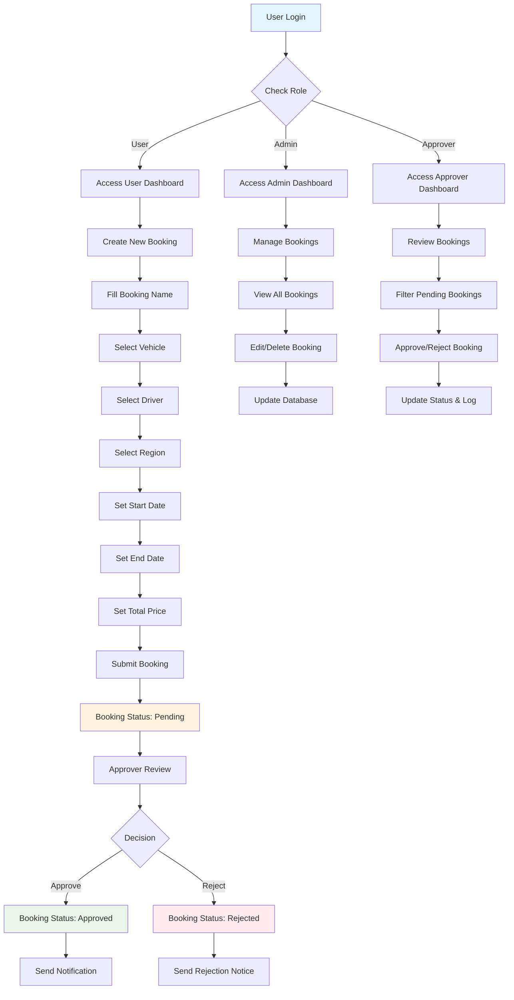

<p align="center">
  
</p>

# Aplikasi Pemesanan Kendaraan

## Daftar Username & Password

| Email               | Password | Role     |
| ------------------- | -------- | -------- |
| admin@gmail.com     | 12345678 | admin    |
| approver1@gmail.com | 12345678 | approver |

> **Catatan:** Silakan sesuaikan username & password sesuai data di database Anda.

---

## Versi Database

-   Mendukung MySQL, PostgreSQL, dsb (bisa diatur di `.env`)

## Versi PHP

-   **PHP 8.2** atau lebih baru

## Framework

-   **Laravel 12.x**

---

## Panduan Penggunaan Aplikasi

### 1. Clone Repository

```bash
git clone https://github.com/DimassRfyy/SekawanMedia-Test
cd SekawanMedia-Test
```

### 2. Install Dependencies

```bash
composer install
```

### 3. Setup Environment

```bash
cp .env.example .env
```

Edit file `.env` dan sesuaikan konfigurasi database:

```env
DB_CONNECTION=mysql
DB_HOST=127.0.0.1
DB_PORT=3306
DB_DATABASE=nama_database_anda
DB_USERNAME=username_database_anda
DB_PASSWORD=password_database_anda
```

### 4. Generate Application Key

```bash
php artisan key:generate
```

### 5. Run Database Migrations

```bash
php artisan migrate
```

### 6. Seed Database

```bash
php artisan db:seed
```

### 7. Start Development Server

```bash
php artisan serve
```

Aplikasi akan berjalan di `http://localhost:8000`

---

## Fitur Aplikasi

### Dashboard Admin

-   **Manajemen User**: Kelola pengguna sistem
-   **Manajemen Region**: Kelola wilayah/daerah
-   **Manajemen Vehicle**: Kelola data kendaraan
-   **Manajemen Driver**: Kelola data pengemudi
-   **Manajemen Booking**: Kelola pemesanan kendaraan
-   **Statistik**: Grafik dan laporan pemesanan

### Dashboard Approver

-   **Review Booking**: Persetujuan pemesanan kendaraan

---

## Physical Data Model

### Entity Relationship Diagram (ERD)

```
┌─────────────┐    ┌─────────────┐    ┌─────────────┐
│    users    │    │   regions   │    │   vehicles  │
├─────────────┤    ├─────────────┤    ├─────────────┤
│ id (PK)     │    │ id (PK)     │    │ id (PK)     │
│ name        │    │ name        │    │ name        │
│ email       │    │ type        │    │ type        │
│ role        │    │ created_at  │    │ ownership   │
│ password    │    │ updated_at  │    │ brand       │
│ created_at  │    └─────────────┘    │ model       │
│ updated_at  │              │        │ created_at  │
└─────────────┘              │        │ updated_at  │
         │                   │        └─────────────┘
         │                   │                 │
         │                   │        ┌─────────────┐
         │                   │        │   drivers   │
         │                   │        ├─────────────┤
         │                   │        │ id (PK)     │
         │                   │        │ name        │
         │                   │        │ phone       │
         │                   │        │ created_at  │
         │                   │        │ updated_at  │
         │                   │        └─────────────┘
         │                   │                 │
         │                   │        ┌─────────────┐
         └───────────────────┼────────│  bookings   │
                             │        ├─────────────┤
                             │        │ id (PK)     │
                             │        │ name        │
                             │        │ user_id     │
                             │        │ vehicle_id  │
                             │        │ driver_id   │
                             │        │ region_id   │
                             │        │ start_date  │
                             │        │ end_date    │
                             │        │ status      │
                             │        │ total_price │
                             │        │ created_at  │
                             │        │ updated_at  │
                             │        └─────────────┘
                             │
                             └────────┘
```

### Relasi Antar Tabel

-   **users** → **bookings** (1:N) - Satu user dapat membuat banyak booking
-   **vehicles** → **bookings** (1:N) - Satu kendaraan dapat dipesan berkali-kali
-   **drivers** → **bookings** (1:N) - Satu driver dapat mengemudikan banyak booking
-   **regions** → **bookings** (1:N) - Satu region dapat memiliki banyak booking
-   **regions** → **vehicles** (1:N) - Satu region dapat memiliki banyak kendaraan

### Struktur Tabel Detail

#### Tabel `users`

-   `id` (Primary Key)
-   `name` - Nama pengguna
-   `email` - Email pengguna (unique)
-   `role` - Role pengguna (admin/approver/user)
-   `password` - Password terenkripsi
-   `created_at`, `updated_at` - Timestamps

#### Tabel `regions`

-   `id` (Primary Key)
-   `name` - Nama wilayah
-   `type` - Tipe wilayah
-   `created_at`, `updated_at` - Timestamps

#### Tabel `vehicles`

-   `id` (Primary Key)
-   `name` - Nama kendaraan
-   `type` - Tipe kendaraan
-   `ownership` - Status kepemilikan
-   `brand` - Merek kendaraan
-   `model` - Model kendaraan
-   `created_at`, `updated_at` - Timestamps

#### Tabel `drivers`

-   `id` (Primary Key)
-   `name` - Nama pengemudi
-   `phone` - Nomor telepon pengemudi
-   `created_at`, `updated_at` - Timestamps

#### Tabel `bookings`

-   `id` (Primary Key)
-   `name` - Nama pemesanan
-   `user_id` (Foreign Key) - ID pengguna yang memesan
-   `vehicle_id` (Foreign Key) - ID kendaraan yang dipesan
-   `driver_id` (Foreign Key) - ID pengemudi
-   `region_id` (Foreign Key) - ID wilayah
-   `start_date` - Tanggal mulai pemesanan
-   `end_date` - Tanggal selesai pemesanan
-   `status` - Status pemesanan (pending/approved/rejected)
-   `total_price` - Total harga pemesanan
-   `created_at`, `updated_at` - Timestamps

---

## Activity Diagram - Fitur Pemesanan Kendaraan




---

## Logging System

### Log File Location

```
storage/logs/laravel.log
```

### Logged Activities

#### User Activities

-   Login/Logout events
-   Profile updates
-   Password changes

#### Booking Activities

-   Booking creation
-   Booking updates
-   Booking deletion
-   Status changes (pending → approved/rejected)
-   Approval/rejection actions

#### Vehicle & Driver Activities

-   Vehicle registration
-   Driver registration
-   Status updates
-   Assignment changes

### Log Format

```log
[2024-01-15 10:30:45] local.INFO: User admin@gmail.com created booking "Meeting Jakarta" for vehicle Toyota Avanza with driver John Doe
[2024-01-15 11:15:22] local.INFO: Approver approver1@gmail.com approved booking "Meeting Jakarta" (ID: 123)
[2024-01-15 14:20:10] local.INFO: User admin@gmail.com updated vehicle "Toyota Avanza" ownership to 'company'
[2024-01-15 15:30:15] local.INFO: Booking "Meeting Jakarta" status changed from 'pending' to 'approved'
[2024-01-15 16:45:30] local.INFO: Driver John Doe assigned to booking "Meeting Jakarta" for region Jakarta
```


---

## Kontribusi

1. Fork repository
2. Buat branch fitur baru (`git checkout -b feature/AmazingFeature`)
3. Commit perubahan (`git commit -m 'Add some AmazingFeature'`)
4. Push ke branch (`git push origin feature/AmazingFeature`)
5. Buat Pull Request

---

## Lisensi

Distributed under the MIT License. See `LICENSE` for more information.

---

## Kontak

-   Email: [m.dimas.rafi12@gmail.com]
-   Project Link: [https://github.com/DimassRfyy/SekawanMedia-Test]
